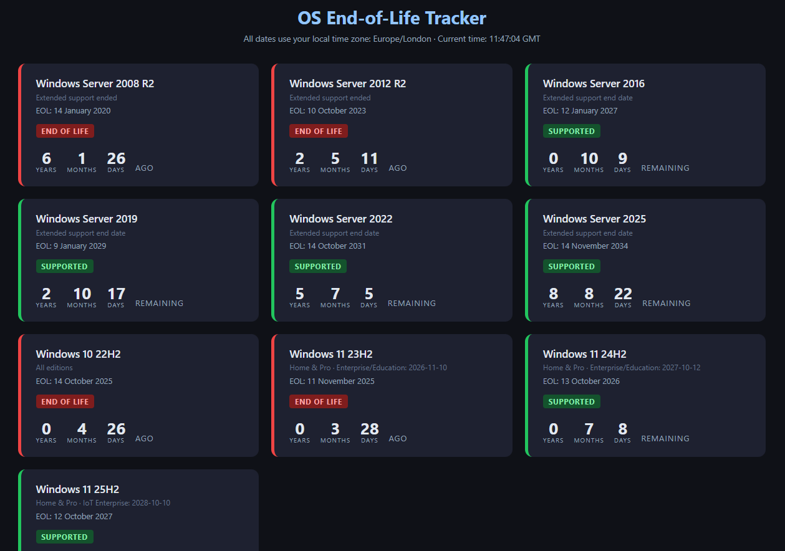

# oseoltracker
End of life tracker for operating systems

This simple application shows the end of life of several popular Microsoft operating systems, but can easily extended to show more. It was developed for internal use only at Dorset HealthCare University NHS Foundation Trust.

[**View the end of life tracker**](eol_tracker.html)

## Use of artificial intelligence
The code for this application was generated by artificial intelligence, namely *Claude Sonnet 4.6* using Perplexity. The prompt used was as follows:

> Write me a simple HTML/javascript app that I can run locally (single html file) that shows a countdown to/countup from the end-of-life of the following operating systems:
> * Windows Server 2008 R2
> * Windows Server 2012 R2
> * Windows Server 2016
> * Windows Server 2019
> * Windows Server 2022
> * Windows Server 2025
> * Windows 10 22H2
> * Windows 11 23H2
> * Windows 11 24H2
> * Windows 11 25H2
>
> The code should not be obfuscated and should be clear to understand. I will want to add and remove operating systems and other pieces of software to the application as time goes by. The application should use the local time zone or, if this is not possible, use UTC. In either case, it should be clear which time zone is in use.